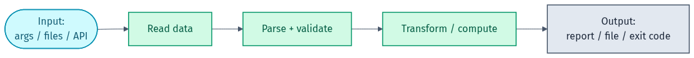
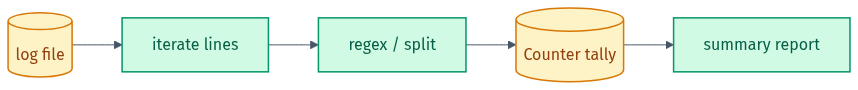
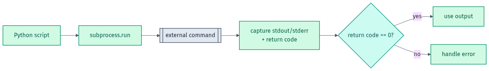

# 🖼️ Diagram Gallery — Python for DevOps

Rendered diagrams for this lab in **light + dark**. They adapt to your GitHub theme below; grab the files directly for slides or LinkedIn.

- Light: `NN-name.png` / `.svg` · Dark: `NN-name-dark.png` / `.svg`
- Editable Mermaid source lives in [`src/`](src). Re-render from the repo root with `render-diagrams.ps1`.

## 🎨 Colour legend
| Colour | Means |
|--------|-------|
| 🔵 Cyan | input / start |
| 🟢 Teal / Green | processing steps |
| 🟠 Amber | files / data |
| ⚪ Slate | output / external |

---

### Anatomy of a DevOps script
Read input → parse/validate → transform → output. Most automation scripts follow this shape.

<picture><source media="(prefers-color-scheme: dark)" srcset="01-script-anatomy-dark.png"></picture>

### Log parsing pipeline
<picture><source media="(prefers-color-scheme: dark)" srcset="02-log-parsing-dark.png"></picture>

### Running a command with subprocess
<picture><source media="(prefers-color-scheme: dark)" srcset="03-subprocess-dark.png"></picture>

---

Made by **Shubham Sharma** · [GitHub](https://github.com/shubhs248) · [LinkedIn](https://www.linkedin.com/in/shubhs248)
